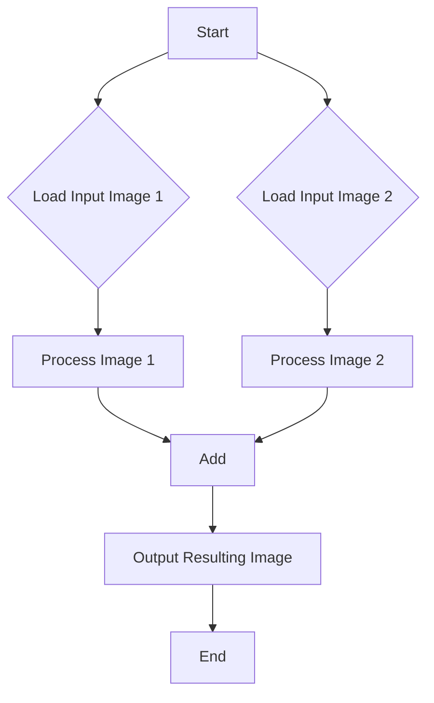
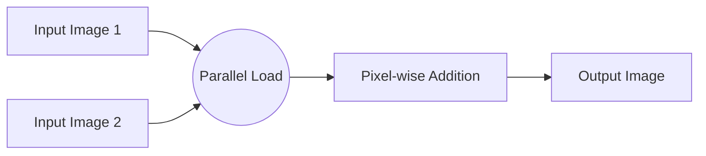

```mermaid
%%{init: {"flowchart": {"htmlLabels": false}} }%%
flowchart TD
    A[Start] --> B{Load Input Image 1} & C{Load Input Image 2}
    B --> D[Process Image 1]
    C --> E[Process Image 2]
    D & E --> F[Add]
    F --> G[Output Resulting Image]
    G --> H[End]
```

```mermaid
graph LR
    image1[Input Image 1]
    image2[Input Image 2]
    parallel_load((Parallel Load))
    addition[Pixel-wise Addition]
    output[Output Image]

    image1 --> parallel_load
    image2 --> parallel_load
    parallel_load --> addition
    addition --> output
```

